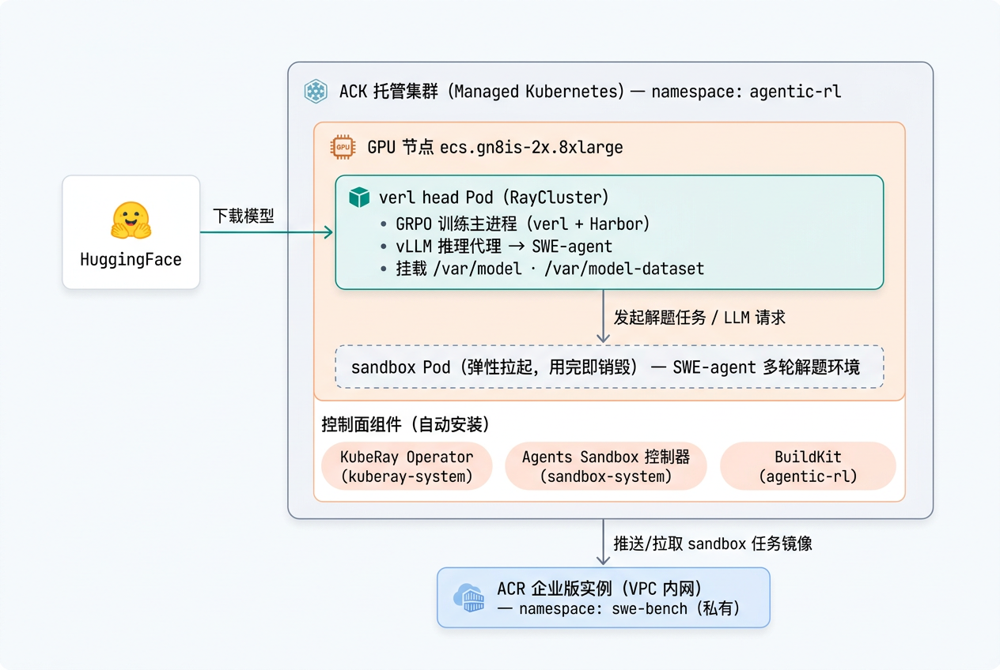

# Agentic RL 训练服务 —— 部署后使用文档

> 适用服务：**Agentic RL（verl + Harbor + ACK）GPU 训练服务**
> 本文覆盖：服务由哪些资源组成、整体架构、如何快速跑通验证、以及如何升级使用（更大模型 / 更多 GPU）。
> 部署参数填写请见服务详情页说明，本文只讲**部署成功之后**的事。

---

## 1. 背景

Agentic RL（智能体强化学习）是当前提升大模型“自主解题能力”的主流训练范式：让模型在真实环境里多轮交互（写代码、跑命令、看结果），再用 RL 算法根据任务完成情况更新权重。

本服务基于阿里云 ACK 官方文档方案构建：[在ACK上使用verl框架进行Agentic强化学习训练](https://help.aliyun.com/zh/ack/training-agentic-reinforcement-learning-on-ack-using-the-verl-framework)，将其中涉及的组件整合为一键部署的 GPU 训练服务，所有依赖全部预置，部署完成后开箱即可训练，无需手动安装任何组件。

| 组件 | 作用 |
|---|---|
| **verl** | 开源 RL 训练框架，负责 GRPO 训练流程编排与模型更新 |
| **Harbor** | 训练任务编排层，对接 SWE-bench 数据集与 sandbox 环境 |
| **SWE-bench** | 真实 GitHub issue 解题基准，作为训练/验证数据集 |
| **SWE-agent** | 在 sandbox 容器内多轮执行解题动作的 agent |
| **ACK + KubeRay** | 提供 GPU 资源与 RayCluster 运行时；sandbox 任务以容器形式在集群内弹性拉起 |

---

## 2. 计费说明

本服务软件本身**免费**，只需为部署时实际创建的云资源付费（ACK 集群与 GPU 节点、云盘、ACR 实例等）。具体费用与所选资源规格相关（如 GPU 节点规格、付费类型、存储卷大小），可在**创建服务实例时的费用预估页面**查看。

> 提示：训练为单机模式，默认 1 台 GPU 节点即可，多出的节点会闲置并额外计费；不使用时及时释放服务实例，避免按量资源持续产生费用。

---

## 3. 资源组成与架构

### 3.1 架构图



### 3.2 服务创建了什么资源

部署时 ROS 模板会自动创建以下资源，按层级拆解：

**① 网络与基础设施**

| 资源 | 说明 |
|---|---|
| VPC + 交换机 | 支持新建或选择已有 VPC（部署参数 `VpcOption`）|
| ACK 托管集群 | 新建集群，网络插件默认 flannel；含 GPU worker 节点（默认 1 台 `ecs.gn8is-2x.8xlarge` = 2×L20 / 32 vCPU / 256GB），系统盘 cloud_essd 200GB |
| ACR 企业版实例 | 存放 sandbox 任务镜像；自动创建 `swe-bench` 命名空间（私有），并打通集群所在 VPC 的内网访问端点 |

**② 集群控制面组件**

| 组件 | 命名空间 | 作用 |
|---|---|---|
| KubeRay Operator | `kuberay-system` | 提供 RayCluster CRD，管理 Ray 集群生命周期 |
| OpenKruise Agents Sandbox 控制器（v0.3.0） | `sandbox-system` | 提供 sandboxes / sandboxsets / sandboxclaims 等 CRD，管理 SWE-agent 解题用的 sandbox Pod |
| ack-helm-manager | - | Helm 应用管理组件 |

**③ 训练工作负载（命名空间 `agentic-rl`）**

| 资源 | 名称 | 作用 |
|---|---|---|
| ServiceAccount + Role/RoleBinding | `rayclustertest` | 已配好训练所需 RBAC：pods 增删查改、pods/log、pods/exec、secrets 读取（BuildKit 推镜像取 ACR 凭证）、batch jobs、sandbox 系列 CRD |
| Secret（dockerconfigjson） | `acr-registry` | ACR 镜像拉取/推送密钥（用部署时填的 ACR 账号密码生成）|
| Deployment + Service | `buildkitd` | 首次训练时构建 sandbox 任务镜像并推到 ACR，地址 `tcp://buildkitd.agentic-rl.svc:1234` |
| PVC（云盘） | `verl-models`（默认 200Gi）| 模型卷，挂到 head Pod `/var/model` |
| PVC（云盘） | `verl-dataset`（默认 100Gi）| 数据/checkpoint 卷，挂到 head Pod `/var/model-dataset`（同时作为 `HF_HOME` 缓存目录）|
| ConfigMap | `agentic-run-script` | 内置冒烟训练脚本 `run-2gpu.sh`，以**只读**方式挂载到 head Pod `/opt/agentic/`，其中 ACR 仓库地址已自动注入 |
| RayCluster | `raycluster-verl` | 仅一个 head Pod（单机多卡），跑 verl 训练镜像（默认 `verl:2.47.1-patched`），申请 `GpuPerNode` 张 GPU（默认 2）|

### 3.3 数据流：一个训练 step 是怎么跑的

1. **vLLM 加载模型**：head Pod 内 vLLM 加载 `/var/model` 的基座模型，启动推理代理（`Proxy server started at http://<head-ip>:xxxxx`）。
2. **构建 sandbox 镜像（仅首次）**：训练脚本通过 BuildKit 构建任务镜像（`FROM swebench/...`）并推送到 ACR 的 `swe-bench` 命名空间，随后以 SandboxClaim 方式拉起 `<task>-xxxx` 的 sandbox Pod。
3. **Agent 解题**：SWE-agent 在 sandbox 里多轮调用 head Pod 的 LLM 代理（写代码、跑命令、看结果），每个任务最多 8 轮交互。
4. **算 reward 并更新**：Harbor 采集轨迹、按任务完成情况计算 reward，verl 执行 GRPO 的 `update_actor` 更新权重。
5. **保存 checkpoint**：按 `save_freq` 落盘到 `/var/model-dataset/checkpoint/`。

---

## 4. 快速开始：跑通冒烟验证

### 4.1 进入训练 Pod

所有训练操作都在 verl head Pod（名称形如 `raycluster-verl-head-xxxxx`）内进行，后续步骤都在它的 shell 里执行：

1. 打开 **容器服务 ACK 控制台** → 找到输出里的 `ClusterId` 对应集群。
2. 左侧 **工作负载 → 容器组（Pods）**，命名空间选 `agentic-rl`。
3. 找到 `raycluster-verl-head-xxxxx`，点右侧 **终端**，即可进入 Pod 的交互 shell。


### 4.2 预置模型与数据集（首次必做）

> **⚠️ 重要：这是部署后第一步，不做无法训练。**
> 服务只负责把基础设施（集群、GPU、RayCluster、BuildKit、RBAC、存储卷）拉起来。两个持久卷**初始为空**：`/var/model`（模型）和 `/var/model-dataset`（数据/checkpoint）；**不预置任何模型和数据集**。
> 因此每次全新部署后，你必须自己：①下载模型到 `/var/model`；②下载数据集到 `/home/verl`；③按 4.3 启动冒烟训练（预置脚本里的参数就是「训练配置」，无需依赖任何额外配置）。

**在 head Pod 内执行**（下载到 PVC，Pod 重启不丢）：

```bash
# 1) 下载模型到 /var/model（香港区直连 HuggingFace 很快）
# 注：镜像内已确认可用的是 huggingface-cli（新版 huggingface_hub 也可用简写 hf）
huggingface-cli download Qwen/Qwen2.5-3B-Instruct --local-dir /var/model/Qwen2.5-3B-Instruct

# 2) 下载 SWE-bench 数据集到 /home/verl（注意名字带 swe-bench/ 前缀）
harbor dataset download swe-bench/swe-bench-verified -o /home/verl
# 产出：/home/verl/swe-bench-verified/<task>/{task.toml, instruction.md, environment, tests}
```

> HuggingFace 缓存目录 `HF_HOME` 已指向持久卷 `/var/model-dataset/hf-home`，Pod 重启后无需重新下载。

### 4.3 启动冒烟训练（1 个任务，约 5~7 分钟）

部署时已把冒烟脚本**预置在 head Pod 内**（ConfigMap 挂载为只读文件 `/opt/agentic/run-2gpu.sh`；其中 sandbox 镜像仓库地址 `REGISTRY` 已按你的 ACR 实例**自动注入**，无需手改）。脚本用**双卡 L20 训练 Qwen2.5-3B**、跑 1 个任务，已验证跑通。

在 head Pod 内直接后台启动，日志写到 `/tmp/train.log`：

```bash
cd /home/verl && nohup bash /opt/agentic/run-2gpu.sh > /tmp/train.log 2>&1 &
```

想先看脚本内容：`cat /opt/agentic/run-2gpu.sh`。

### 4.4 监控进度与验证成功

在 head Pod 内实时看日志：

```bash
tail -f /tmp/train.log
```

**验证成功的标志**（对照日志）：

- Pod 全程 `RESTARTS 0`
- 有 validation 指标：`val-core/harbor/reward/mean@1`（小样本下为 `0.0` 属正常）、`val-aux/num_turns/mean`（agent 真实多轮交互，>0）
- 优化器 step 越过：`timing_s/update_actor` 有值、`actor/pg_loss`、`actor/grad_norm` 有值
- checkpoint 落盘到 `/var/model-dataset/checkpoint/`
- 结束打印 `Training Progress: 100%`

> reward=0 不代表链路有问题：3B 模型小样本下解不出 SWE-bench 题属正常现象，优化器/检查点链路仍完整跑通。想看到非零 reward 需换更强模型或扩大样本。

---

## 5. 进阶使用

### 正式训练（全量任务）

预置脚本是只读的，先拷出来再改：`cp /opt/agentic/run-2gpu.sh /home/verl/run-formal.sh`，编辑后 `nohup bash /home/verl/run-formal.sh > /tmp/train.log 2>&1 &`。冒烟→正式主要改这几处：

| 参数 | 冒烟值 | 正式建议 |
|---|---|---|
| `data.harbor_train_limit` / `harbor_val_limit` | `1` | **去掉这两行**（用全量任务）|
| `data.train_batch_size` | `1` | `≥ n_gpus`（如 8、16）|
| `actor_rollout_ref.actor.ppo_mini_batch_size` | `1` | dp_size 的整数倍 |
| `trainer.total_epochs` / `trainer.save_freq` | `1` / `1` | 按需要设 |

> 双卡 L20 下，`param_offload`、`optimizer_offload`、`tensor_model_parallel_size=2` 是 3B 不 OOM 的关键，**同规格不要动**。

### 换 GPU 规格 / 换更大模型

方向上支持，但需自行验证。核心约束只有一条——下面三个数必须完全相等，否则 head Pod 调度不出来（Pending）或训练报错：

```
ECS 规格物理卡数  ==  GpuPerNode（部署参数）  ==  trainer.n_gpus_per_node（脚本）
```

- **换卡数/卡型**：改部署参数 `WorkerInstanceType`、`GpuPerNode`，同步改脚本 `trainer.n_gpus_per_node`、`tensor_model_parallel_size`（需整除卡数）。
- **换更大模型**：模型下到 `/var/model/` 后改脚本 `actor_rollout_ref.model.path`；模型越大越吃显存，OOM 时依次尝试：调低 `gpu_memory_utilization`、保持 offload 开启、调小 `ppo_max_token_len_per_gpu` 与序列长度，或直接升 GPU 规格。
- **多机多卡**：当前不支持（RayCluster 只有 head，`trainer.nnodes=1`），属结构性改动。

> 换 GPU 规格时注意：目标可用区要有该规格库存；head Pod 与 sandbox pod 共用节点，`RayHeadMemory` 不能占满节点内存，否则 sandbox pod 会 Pending。